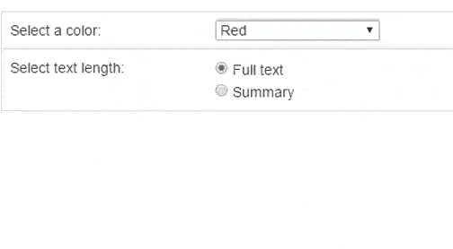

# jQuery Conditioner

This plugin allows to conditionally display elements based on an input element value. It has inline-options feature which allows to do this very easily, something similar to angular JS's `ng-if` feature.

[](http://http://www.aakashweb.com/demos/jquery-conditioner)

This plugin was created for [WP Socializer](http://www.aakashweb.com/wordpress-plugins/wp-socializer/) and WP Socializer heavily uses this plugin to conditionally show/hide options in the admin settings page.

[Open demo](http://www.aakashweb.com/demos/jquery-conditioner)

#### Example:

```HTML
<select id="fruits">
    <option value="apple">Apple</option>
    <option value="banana">Banana</option>
    <option value="mango">Mango</option>
</select>

<!-- Plugin options given inline -->
<div class="banana-section"
data-condr-input="#fruits"
data-condr-value="banana"
data-condr-action="simple?show:hide"
data-condr-events="click">
    Here are the Banana options ..
</div>

<script>$('.banana-section').conditioner();</script>
```

In the above example `.banana-section` will be displayed only when the value of `#fruits` is `banana`

### Options

Options can be set in two different ways.

- Inline options ( above example, supports only one condition )
- External options ( below example, supports multiple conditions )

### External Options

```javascript
$('.elementToShow').conditioner({
    // Check multiple conditions from different inputs. Condition will pass only if all of them satisfy
    conditions: [
        {
            input: '.textbox',
            type: 'simple', // If value is a pattern to match then type is 'pattern'
            value: 'hey'
        },
        {
            input: '[name=agreecheck]',
            type: 'simple',
            value: 'agree'
        },
        {
            input: '.checkbox'
        },
    ],
    events: 'click keyup',
    onTrue: function(){  $(this).fadeIn( 'slow' );  },
    onFalse: function(){  $(this).slideUp( 'slow' );  }
});
```

### Documentation

[Click here](http://www.aakashweb.com/docs/jquery-conditioner-docs/) to see the docs of this plugin.

### License

Copyright (c) 2016 [Aakash Chakravarthy](http://www.aakashweb.com/), released under the MIT License.